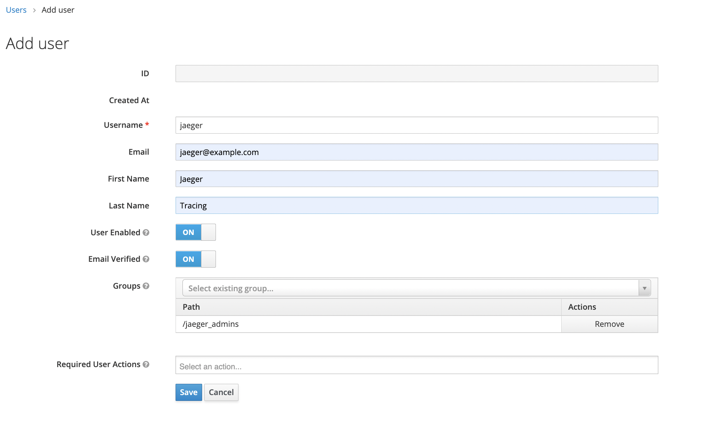
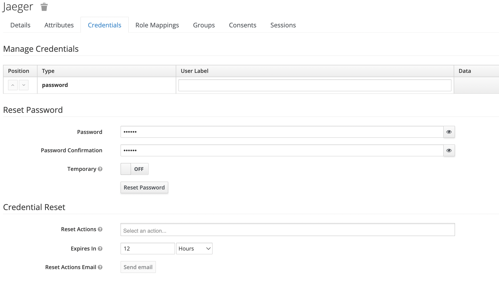

# jaeger-secure
## Setup
```shell
git clone https://github.com/codesenju/docker_IaC_project.git
cd docker_IaC_project
docker-compose up -d keycloak
ansible-playbook playbook.yml --tags jaeger-client --vault-password-file vault_password
```
```shell
echo "network=docker_IaC_project" > .env
```
```shell
cd ../
```


```shell
git clone https://github.com/codesenju/jaeger-secure.git
cd jaeger-secure
docker-compose up -d
```

## Create user `jaeger` and add to `jaeger_admins` group:


## Set the password:

## Go to [localhost:16686](localhost:16686/) and login as the jaeger user you created earlier.